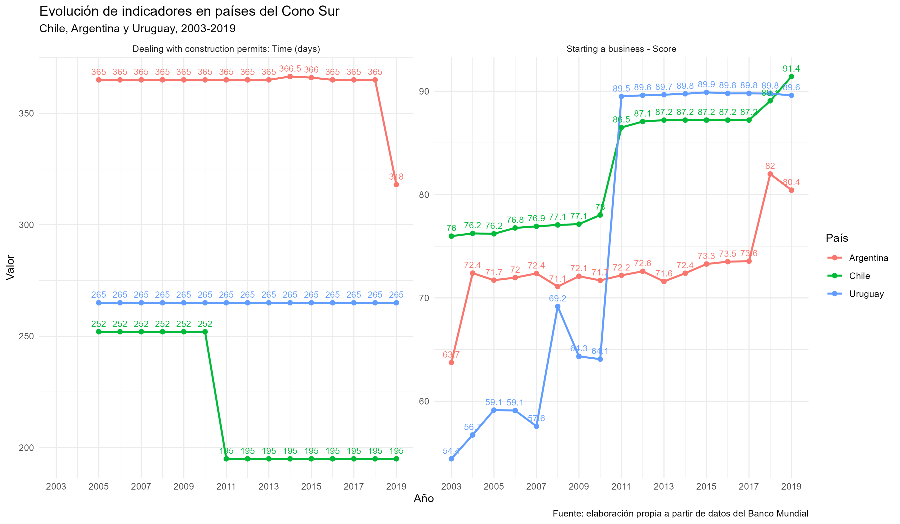

```{r}
#| label: setup
#| include: false

library(readr)
library(dplyr)
library(knitr)
library(tibble)
```

## Resumen del informe

Este informe presenta una lectura descriptiva de los principales productos generados en el proyecto de visualización de indicadores Doing Business del Banco Mundial para Chile, Argentina y Uruguay.

El análisis se concentra en dos indicadores:

```{r}
#| label: tabla-indicadores
#| echo: false

indicadores <- tribble(
  ~Indicador, ~Descripcion,
  "Dealing with construction permits: Time (days)", "Tiempo requerido para obtener permisos de construcción, medido en días.",
  "Starting a business - Score", "Puntaje asociado a la facilidad para iniciar un negocio."
)

kable(indicadores)
```

El objetivo de este informe es mostrar los datos procesados, la tabla resumen y la visualización estática generada por el proyecto. El documento tiene un alcance descriptivo y está pensado como complemento del dashboard interactivo.

## Archivos utilizados

El informe utiliza dos archivos generados por el flujo de procesamiento del proyecto:

```{r}
#| label: tabla-archivos-utilizados
#| echo: false

archivos_utilizados <- tribble(
  ~Archivo, ~Ruta_en_el_proyecto, ~Uso,
  "tabla_conosur_resumen.csv", "03_outputs/01_tables/tabla_conosur_resumen.csv", "Tabla descriptiva con valores iniciales, finales, variaciones y estadísticos básicos.",
  "grafico_conosur_serie_temporal.png", "03_outputs/02_figures/grafico_conosur_serie_temporal.png", "Visualización estática de los indicadores seleccionados."
)

kable(archivos_utilizados)
```

## Tabla resumen

La siguiente tabla corresponde al archivo `tabla_conosur_resumen.csv`. Esta salida resume cada combinación entre país e indicador mediante medidas descriptivas básicas.

```{r}
#| label: cargar-tabla-resumen
#| echo: false
#| warning: false
#| message: false

tabla_resumen <- read_csv(
  "../03_outputs/01_tables/tabla_conosur_resumen.csv",
  show_col_types = FALSE
)

kable(tabla_resumen)
```

La tabla permite revisar:

1.  Cantidad de años con datos disponibles.
2.  Primer año observado.
3.  Último año observado.
4.  Valor inicial de la serie.
5.  Valor final de la serie.
6.  Variación absoluta entre el valor inicial y final.
7.  Promedio del periodo observado.
8.  Valor mínimo.
9.  Valor máximo.

Esta salida permite comparar rápidamente la evolución de cada país dentro de los indicadores seleccionados.

## Visualización estática

La siguiente imagen corresponde al gráfico estático generado por el proyecto.

```{r}
#| label: grafico-conosur
#| echo: false
#| out-width: "100%"
#| fig-align: "center"
#| fig-cap: "Evolución de indicadores Doing Business seleccionados para Chile, Argentina y Uruguay."


```

El gráfico presenta dos indicadores con unidades distintas. Por esa razón, las visualizaciones se muestran separadas.

El primer gráfico muestra el indicador `Dealing with construction permits: Time (days)`, medido en días. En este indicador, valores más bajos representan una menor cantidad de tiempo requerido para completar los procedimientos asociados a permisos de construcción.

El segundo gráfico muestra el indicador `Starting a business - Score`, medido como puntaje. En este indicador, valores más altos representan una mejor posición dentro de la medición de facilidad para iniciar un negocio.

## Lectura descriptiva

La tabla y el gráfico permiten observar la evolución de los indicadores seleccionados para Chile, Argentina y Uruguay entre 2003 y 2019.

En el indicador de permisos de construcción, la lectura se centra en la cantidad de días requeridos. Esto permite comparar diferencias entre países y observar si las series presentan estabilidad, reducción o aumento durante el periodo disponible.

En el indicador de facilidad para iniciar un negocio, la lectura se centra en el puntaje. Esto permite observar la trayectoria de cada país y comparar los cambios relativos entre el primer y último año disponible.

A partir de ambos productos, el análisis descriptivo permite revisar:

1.  La dirección de cambio de cada país.
2.  La magnitud de la variación entre el primer y último año observado.
3.  La distancia relativa entre Chile, Argentina y Uruguay.
4.  La estabilidad o variación de cada serie.
5.  Las diferencias de cobertura temporal entre indicadores.

Este informe no interpreta los cambios como efectos causales. Su función es presentar resultados descriptivos a partir de los datos procesados.

## Relación con el dashboard

El dashboard interactivo permite explorar los mismos indicadores mediante filtros de país, rango de años y visualización de valores.

```{r}
#| label: tabla-informe-dashboard
#| echo: false

comparacion <- tribble(
  ~Producto, ~Funcion,
  "Informe", "Presenta una lectura fija y resumida de la tabla y la visualización principal.",
  "Dashboard", "Permite explorar dinámicamente países, años e indicadores seleccionados."
)

kable(comparacion)
```

El dashboard complementa este informe porque permite modificar el rango temporal, seleccionar países específicos y revisar los valores de forma interactiva.

Disponible en:

<https://diturrietag.shinyapps.io/proyecto-banco-mundial-dashboard/>

## Alcance del análisis

Este informe tiene un alcance descriptivo y de portafolio. Su objetivo es mostrar los productos principales del proyecto y entregar una lectura clara de sus resultados.

El análisis no busca explicar causalmente los cambios observados. Para avanzar hacia una explicación de ese tipo sería necesario incorporar más indicadores, variables adicionales y una estrategia metodológica orientada a inferencia.

El valor principal del proyecto está en integrar un flujo de trabajo reproducible en R:

1.  Carga de datos.
2.  Limpieza y transformación.
3.  Selección de países e indicadores.
4.  Construcción de tabla resumen.
5.  Generación de visualización estática.
6.  Exportación de objetos para dashboard.
7.  Publicación de productos en formato web.

## Cierre

Este informe documenta los productos principales del proyecto y entrega una lectura descriptiva de sus salidas. La combinación entre tabla resumen, gráfico estático y dashboard interactivo permite presentar el análisis de forma clara, reproducible y orientada a portafolio.

Repositorio del proyecto:

<https://github.com/diturrietag/Proyecto-Banco-Mundial>
